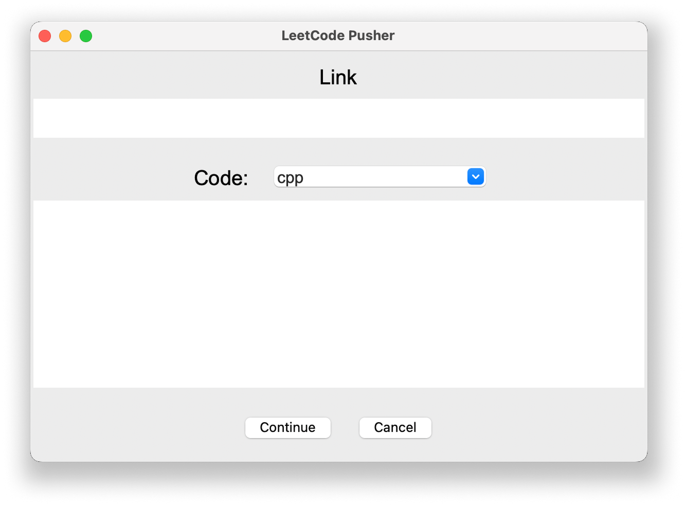

<h1 align="center">LeetCode Pusher</h1>

Simple light-weight application that does what it is called, projects main goal is to resolve the following issue

After solving a Leet Code problem it is motivating to push the question and the solution to my Github however this takes a considirable amount of time.

## How it works

LeetCode Pusher is a light weight python script that pulls the content of the question from the LeetCode API, which is an unoffical API and there is no real support for it we are only just taking advantage of the publicity right now.

Then providing the Operating system with some bash commands to push it to corresponding repository.

  

The only configuration is needed for the script to work is change the directory names written in it. Since your terminal most likely configured with github there is nothing to do on it anyway.

Here is the user interface for the application

  

